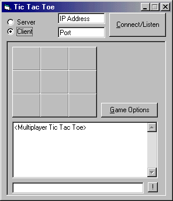



## Multiplayer Tic Tac Toe

### Description

Learn how to use the winsock control and use it in real programs.
 
### More Info
 

             |
---                |---
**Submitted On**   |2000-12-20 16:18:12
**By**             |[Steve Mack](https://github.com/Planet-Source-Code/PSCIndex/blob/master/ByAuthor/steve-mack.md)
**Level**          |Intermediate
**User Rating**    |4.5 (18 globes from 4 users)
**Compatibility**  |VB 5\.0, VB 6\.0
**Category**       |[Games](https://github.com/Planet-Source-Code/PSCIndex/blob/master/ByCategory/games__1-38.md)
**World**          |[Visual Basic](https://github.com/Planet-Source-Code/PSCIndex/blob/master/ByWorld/visual-basic.md)
**Archive File**   |[CODE\_UPLOAD1299112232000\.zip](https://github.com/Planet-Source-Code/steve-mack-multiplayer-tic-tac-toe__1-13823/archive/master.zip)

